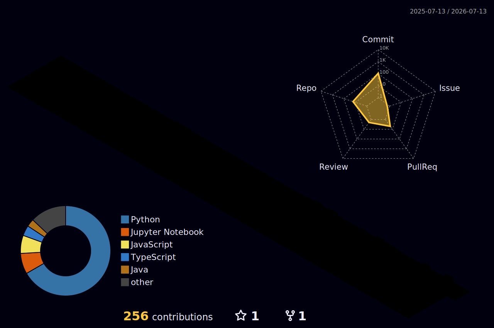

# Hi, I'm Prathamesh Paliwal 👋

**Engineering Student** | **AI/ML Developer** | **Full Stack Developer**

Passionate about building intelligent systems and production-ready applications.

---

## About Me

I specialize in developing AI-powered applications with a focus on computer vision and deep learning. Currently exploring neural network-based control systems and embedded AI.

### What I'm Working On
- Computer Vision applications with pose estimation
- Deep learning models for real-time analysis
- Full stack web applications with modern frameworks

---

## Languages and Tools

  

### Specialized AI/ML Libraries

 

  

---

## Contact

- **GitHub:** [Pratham4040](https://github.com/Pratham4040)
- **Email:** prathameshpaliwal19@gmail.com
- **Location:** India